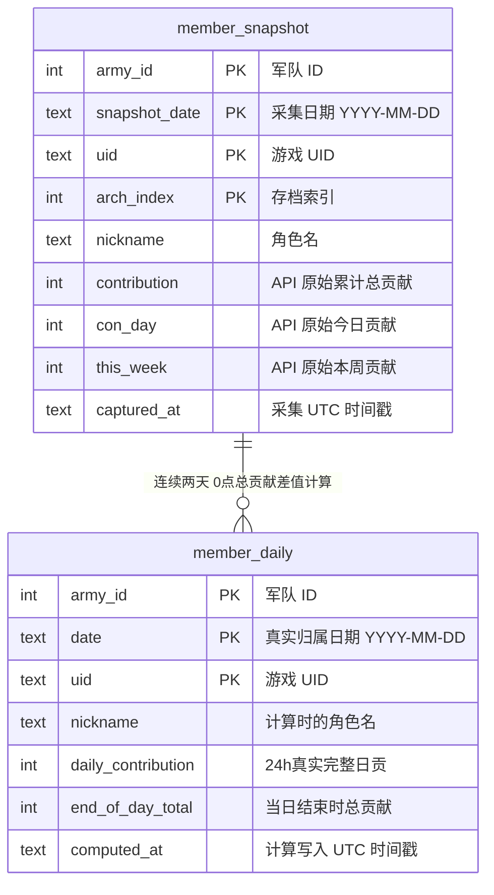
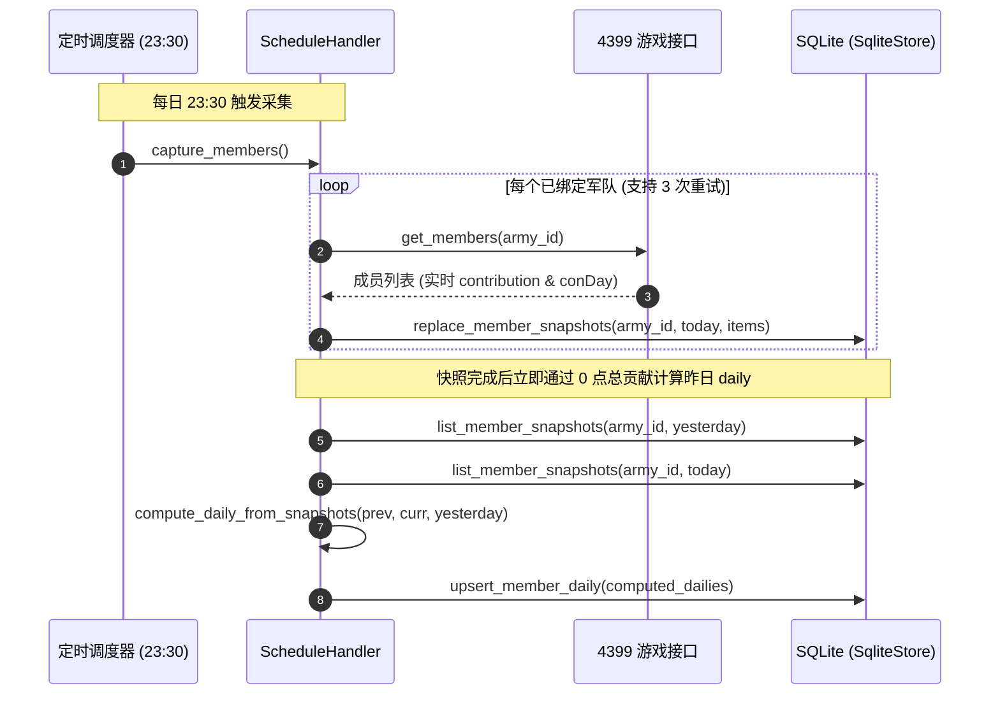
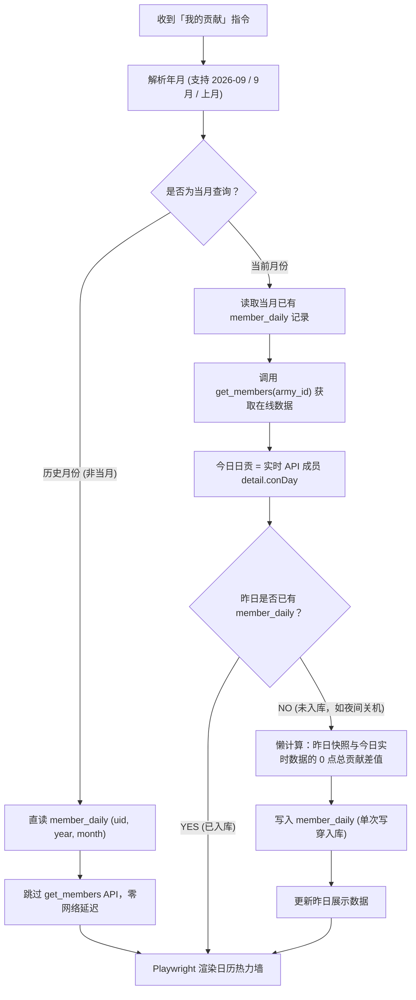

# 每日贡献计算与快照架构设计

本文档详细说明 BQYX（4399《爆枪英雄》）机器人插件中**军队成员快照（`member_snapshot`）**与**每日真实贡献（`member_daily`）**的架构设计、核心算法推导、数据存储与查询流水线。

---

## 一、背景与核心痛点

在《爆枪英雄》（4399 BQYX）游戏中，玩家的贡献数据具有如下接口特性：
1. **`contribution`（历史累计总贡献）**：单调递增的服务端全量累计值。
2. **`conDay`（今日贡献）**：当日实时产生的值，在服务端**每日 00:00:00 准时清零**。
3. **接口限制**：游戏接口不提供“昨日贡献”，一旦越过午夜零点，昨日的 `conDay` 永久归零消失。

### 旧架构的致命缺陷

1. **晚捐款数据丢失（23:40 丢日贡 Bug）**：
   - 之前快照直接将 23:30 采到的 `conDay` 当作全天日贡保存。
   - 若某玩家在 23:40 登录并捐献 100 贡献，这 100 贡献因发生在 23:30 快照之后，永远无法计入快照，导致玩家满贡天数少算、记录失真。
2. **单点失败导致整日断档**：
   - 每天仅 23:30 单次采集，若遇网络抖动或服务重启，当天的快照永久缺失，贡献墙呈现空白。
3. **数据语义杂糅**：
   - 将原始采样值与展示用的真实日贡放在同一张快照表内，既难回溯原始数据，又难以处理跨日补偿。
4. **历史快照被覆盖损坏隐患**：
   - 旧代码在 `hour < 12` 时将采集日期回退到昨天，若在上午执行采集或重试，会用已归零的今日 `conDay` 覆写昨日辛苦采集的完整快照。

---

## 二、核心数学原理：0 点总贡献差值算法

为彻底解决采样时点之后产生贡献被丢失的问题，采用 **0点总贡献（DayStartTotal）推导算法**。

### 1. 概念定义：0 点总贡献

对任意第 $D$ 天，定义其**0点总贡献**（即当天 00:00:00 初始时刻的累计总贡献）为：
$$\text{DayStartTotal}(D) = \text{contribution}(D) - \text{conDay}(D)$$

### 2. 关键数学特性：0 点总贡献在日内任意时刻计算均恒定

在同一自然日 $D$ 内，玩家所做的任何新贡献 $\Delta c$ 都会**同时且等额地**累加到 `contribution`（累计总贡）和 `conDay`（今日日贡）中：
- $\text{contribution}' = \text{contribution} + \Delta c$
- $\text{conDay}' = \text{conDay} + \Delta c$

因此两者相减：
$$\text{DayStartTotal}'(D) = (\text{contribution} + \Delta c) - (\text{conDay} + \Delta c) = \text{contribution} - \text{conDay} = \text{DayStartTotal}(D)$$

> **核心结论**：无论在当天的 10:00、18:00 还是 23:30 采样，$\text{contribution} - \text{conDay}$ 都严格恒等于**该自然日 00:00:00 的总贡献底数**！

### 3. 真实日贡与结束总贡献推导

- **第 $D$ 天结束时的累计总贡献**：即下一天（第 $D+1$ 天）的 0 点总贡献：
  $$\text{EndOfDayTotal}(D) = \text{DayStartTotal}(D+1)$$
- **第 $D$ 天全天 24 小时真实完整日贡**：即前后两天 0 点总贡献的净差值：
  $$\text{DailyContribution}(D) = \text{DayStartTotal}(D+1) - \text{DayStartTotal}(D)$$

### 4. 23:40 晚捐款计算实例验证

| 采样节点 | 累计总贡献 `contribution` | 今日贡献 `conDay` | 计算得到的 0 点总贡献 `DayStartTotal` |
|---|---|---|---|
| **1月2日 23:30 快照** | 10,000 | 1,300 | $\mathbf{8,700}$（1月2日 0点总贡献） |
| *1月2日 23:40 玩家捐款 100* | *10,100* | *1,400* | *8,700（0点总贡献不受影响）* |
| *1月3日 00:00 服务端刷新* | *10,100* | *0* | *10,100（成为 1月3日 0点总贡献）* |
| **1月3日 23:30 快照** (假设1/3捐了1400) | 11,500 | 1,400 | $\mathbf{10,100}$（1月3日 0点总贡献） |

- **真实 1月2日 完整日贡**：
  $$\text{1月3日 0点总贡献} - \text{1月2日 0点总贡献} = 10,100 - 8,700 = \mathbf{1,400}$$
  （精准包含了 23:30 快照后、23:40 补捐的 100 贡献！）。
- **真实 1月2日 结束累计总贡献**：$\mathbf{10,100}$。

---

## 三、两表分离架构设计

将数据流解耦为两个独立表：**`member_snapshot`（原始采样表）**与**`member_daily`（真实日贡表）**。



### 职责边界

| 维度 | `member_snapshot` (原始快照) | `member_daily` (真实日贡) |
|---|---|---|
| **数据性质** | 原始观测样本（Raw Telemetry） | 派生计算结果（Derived Truth） |
| **写入频率** | 每天 23:30 定时写入 | 采集后批量计算写入，或查询时按需懒计算 |
| **主键设计** | `(army_id, snapshot_date, uid, arch_index)` | `(army_id, date, uid)` |
| **留存周期** | 滚动保留 63 天（约 2 个月） | 与快照一致保留 63 天（约 2 个月，由同一环境变量 `BQYX_SNAPSHOT_RETENTION_DAYS` 统一控制清理） |
| **业务用途** | 0 点总贡献输入、昨日贡献命令比对 | 「我的贡献」日历墙直接数据源 |

---

## 四、采集与计算流水线



### 1. 严格自然日归属（修复覆写隐患）
移除旧代码中 `hour < 12` 强行回退昨天的逻辑，`capture_date()` 严格使用上海时区当日：
```python
def capture_date(now: datetime | None = None) -> str:
    return as_shanghai(now).date().isoformat()
```
避免凌晨重试或日间调试时把清零数据覆盖掉昨夜快照。

### 2. 失败重试保护
`_capture_members` 增加针对每个军队的 3 次重试循环（每次间隔 15 秒），网络瞬断不会导致全天快照丢失。

---

## 五、「我的贡献」查询流水线与懒计算机制

用户输入 `我的贡献`、`贡献墙`、`我的日贡`（支持如 `我的贡献 2026-09`、`我的贡献 9月`、`我的贡献 上月`）时的执行逻辑：



### 核心特性说明

1. **今日日贡永远实时**：
   - 处于当月时，今日（`today_str`）的数据直接从 `user.get_members` 返回的 `m.detail.conDay` 读取，反映此时此刻最新的捐献进度。
2. **历史月份零延迟**：
   - 查历史月不调用任何外部 API，完全从本地 `member_daily` 读取，数百毫秒内极速出图。
3. **懒计算写穿缓存（Write-Through Cache）**：
   - 若昨晚机器人处于关机状态，夜间定时任务未执行；
   - 次日用户第一次调用「我的贡献」时，系统检测到昨日 `member_daily` 为空，自动以昨日快照和当前在线数据计算出昨日完整日贡并写入 `member_daily`；
   - **后续用户再次查询时**，由于昨日记录已落库，不会再触发计算和写库操作。
