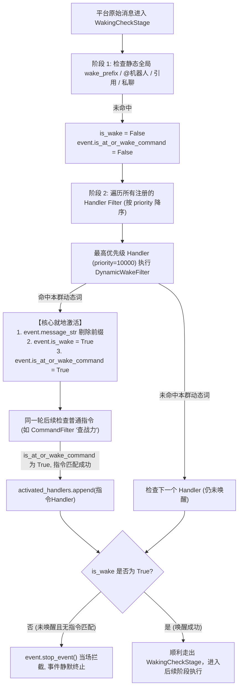

# AstrBot 动态唤醒词（分群/用户/业务逻辑）实现原理与实践指南

本文档系统性剖析 AstrBot 消息流水线中事件唤醒与指令分发的底层状态机机制，并给出在不修改磁盘配置文件的前提下，实现**按群隔离、按用户维度、基于数据库/内存动态计算唤醒词**的完整架构设计与代码实现。

---

## 一、背景与业务需求

AstrBot 默认将唤醒词配置在 `data/config.json` 的 `wake_prefix` 字段中（例如 `["/"]`）。在实际业务场景中，这种全局静态配置存在以下局限：

1. **无法分群个性化**：群 A 希望使用 `小明` 作为呼叫词，群 B 希望使用 `管家`，静态配置是全局生效的，无法做租户或群维度的唤醒隔离；
2. **需要热更新且不落盘**：唤醒词可能由群管理员在聊天中随时通过指令动态设置，或保存在业务数据库（MySQL / SQLite / Redis）中，频繁写入静态配置文件容易导致文件冲突与运维负担；
3. **严格限定群聊作用域**：动态前缀仅在群聊中识别，私聊中完全保留 AstrBot 原生的唤醒与对话逻辑，互不干扰。

---

## 二、AstrBot 核心流水线与唤醒原理

要无缝接入动态唤醒，必须理解 AstrBot 内部处理一条消息时的完整时序与状态机模型。

### 1. 流水线阶段时序（`STAGES_ORDER`）

AstrBot 的消息核心调度器 `PipelineScheduler` 严格按照以下阶段顺序执行：

```text
[1] WakingCheckStage       <--- 唤醒检测与事件过滤器匹配（第一道关卡）
[2] WhitelistCheckStage     <--- 黑白名单校验
[3] SessionStatusCheckStage <--- 会话状态校验
[4] RateLimitStage          <--- 限流检查
[5] ContentSafetyCheckStage <--- 内容安全风控
[6] PreProcessStage         <--- 语音转文字 (STT) 与媒体预处理
[7] ProcessStage            <--- 执行指令 Handler 或调用 LLM 产生回复
[8] ResultDecorateStage     <--- 响应排版修饰
[9] RespondStage            <--- 最终向各平台适配器下发消息
```

---

### 2. `WakingCheckStage` 的内部两阶段决策

消息刚进入 `WakingCheckStage` 时，AstrBot 经历了两个判断阶段：



---

### 3. 两个核心状态变量的决定性作用

在 `AstrMessageEvent` 对象中，有两个最关键的布尔属性：

| 属性名 | 核心作用 | 影响范围 |
| :--- | :--- | :--- |
| **`event.is_wake`** | 决定该消息是否被系统丢弃 | 若走出 `WakingCheckStage` 时仍为 `False`，框架直接调用 `event.stop_event()` 终结事件，后续阶段完全不会执行。 |
| **`event.is_at_or_wake_command`** | **决定 `@filter.command` 与 LLM 对话能否被触发** | AstrBot 内核的 `CommandFilter.filter` 源码第一行即为：<br>`if not event.is_at_or_wake_command: return False`<br>若未将此变量置为 `True`，任何 `@filter.command` 指令都将全部失效。 |

此外，在第 7 阶段 `ProcessStage` 中，触发默认大模型 LLM 对话的准入条件也是：
```python
if not event._has_send_oper and event.is_at_or_wake_command and not event.call_llm:
    # 转发给 LLM Agent
```

---

### 4. 为什么要利用 `priority` 机制？

在 AstrBot 中，所有注册的事件处理器都会被加入 `StarHandlerRegistry`，并在每次注册时**按 `priority` 绝对降序排序**：

```python
# AstrBot 源码 core/star/star_handler.py
self._handlers.sort(key=lambda h: -h.extras_configs["priority"])
```

因此，只要给前置动态唤醒过滤器赋予一个极高的优先级（例如 `priority=10000`）：
1. 它的 `CustomFilter.filter()` 必定排在所有普通指令（默认优先级 `priority=0`）之前被调用；
2. 在这个过滤器内部，一旦识别到本群专属唤醒词，立即**就地修改 `event.message_str` 剥离唤醒词**，并激活 `event.is_at_or_wake_command = True` 和 `event.is_wake = True`；
3. 后续同一轮循环中执行的其他普通指令（如 `@filter.command("查战力")`）在评估时，直接面对的是已经被剥离前缀的纯净指令串，且此时 `is_at_or_wake_command` 已为 `True`，从而实现 100% 原生体验的指令匹配。

---

## 三、完整生产级代码实现

以下代码演示了一个标准的按群/按用户隔离的动态唤醒词插件，支持群管理员动态增删查、内存与数据库管理，且严格限定仅在群聊中生效。

```python
from typing import Any
from astrbot.api.star import Star, register
from astrbot.api.event import AstrMessageEvent, filter
from astrbot.core.star.filter.custom_filter import CustomFilter


# ==============================================================================
# 1. 动态唤醒词仓库 (支持内存缓存、SQLite、Redis 或配置存储)
# ==============================================================================
class DynamicWakeManager:
    """管理每个群/用户的专属唤醒词映射"""

    def __init__(self) -> None:
        # group_id -> set of wake words
        self._group_wake_words: dict[str, set[str]] = {
            # 示例预设：群 123456789 支持 "小助手" 和 "管家"
            "123456789": {"小助手", "管家"},
        }
        # user_id -> set of wake words (可选: 针对特定用户的个性化唤醒)
        self._user_wake_words: dict[str, set[str]] = {}

    def get_wake_words(self, group_id: str, user_id: str = "") -> set[str]:
        words: set[str] = set()
        if group_id and group_id in self._group_wake_words:
            words.update(self._group_wake_words[group_id])
        if user_id and user_id in self._user_wake_words:
            words.update(self._user_wake_words[user_id])
        return words

    def set_group_wake(self, group_id: str, word: str) -> None:
        self._group_wake_words.setdefault(str(group_id), set()).add(word.strip())

    def remove_group_wake(self, group_id: str, word: str) -> None:
        gid = str(group_id)
        if gid in self._group_wake_words:
            self._group_wake_words[gid].discard(word.strip())


wake_manager = DynamicWakeManager()


# ==============================================================================
# 2. 自定义动态唤醒过滤器 (核心状态机驱动)
# ==============================================================================
class DynamicGroupWakeFilter(CustomFilter):
    """前置动态唤醒过滤器：严格按群判定，并就地重写 event 状态。"""

    def filter(self, event: AstrMessageEvent, cfg: Any = None) -> bool:
        group_id = str(event.get_group_id() or "")

        # ⚡ 关键边界约束 1：仅在群聊中激活本功能，私聊直接返回 False 放行原生逻辑
        if not group_id:
            return False

        # ⚡ 关键边界约束 2：如果该消息已经被 @机器人 或已被系统前置唤醒，无需重复提取
        if event.is_wake and event.is_at_or_wake_command:
            return False

        msg = (event.message_str or "").strip()
        if not msg:
            return False

        user_id = str(event.get_sender_id() or "")

        # 动态获取本群与该用户当前配置的有效唤醒词集合
        wake_words = wake_manager.get_wake_words(group_id, user_id)
        if not wake_words:
            return False

        # ⚡ 关键算法细节：按字符长度降序排序进行最长匹配，防止短词破坏长词（如 "小助手" 优先于 "小助"）
        sorted_words = sorted(wake_words, key=len, reverse=True)
        for w in sorted_words:
            if msg.startswith(w):
                # 1. 剥离动态唤醒词前缀，保留纯净的后续指令或自然语言文本
                event.message_str = msg[len(w) :].strip()

                # 2. 核心状态激活（点亮 AstrBot 的生命周期灯）
                event.is_wake = True                # 防止被 WakingCheckStage 丢弃
                event.is_at_or_wake_command = True  # 允许后续 @filter.command 指令匹配

                # 返回 True，表示动态过滤器成功捕获该消息
                return True

        return False


# ==============================================================================
# 3. 插件主类注册与管理指令
# ==============================================================================
@register("group_dynamic_wake", "Author", "分群自定义动态唤醒词系统", "1.0.0")
class GroupDynamicWakePlugin(Star):

    # 声明 priority=10000 最高优先级，保证先于一切普通指令执行唤醒判断与前缀剥离
    @filter.custom_filter(DynamicGroupWakeFilter, priority=10000)
    async def dynamic_wake_entry(self, event: AstrMessageEvent):
        """前置唤醒桩函数：无需任何业务回复逻辑。
        它的使命就是将群事件唤醒。后续如果有指令命中，指令 Handler 会接管；
        如果没有指令命中，AstrBot 将自动交给大模型进行智能对话。
        """
        pass

    # ==================== 管理指令接口 ====================

    @filter.command("设置本群唤醒词", permission_type=filter.PermissionType.ADMIN)
    async def set_group_wake_cmd(self, event: AstrMessageEvent, word: str = ""):
        """为当前群添加专属动态唤醒词（限管理员）。"""
        group_id = str(event.get_group_id() or "")
        if not group_id:
            yield event.plain_result("该指令仅支持在群聊中使用。")
            return

        clean_word = word.strip()
        if not clean_word:
            yield event.plain_result("请提供有效的唤醒词内容。例如：设置本群唤醒词 管家")
            return

        wake_manager.set_group_wake(group_id, clean_word)
        yield event.plain_result(f"🎉 已成功为本群添加专属唤醒词：「{clean_word}」")

    @filter.command("删除本群唤醒词", permission_type=filter.PermissionType.ADMIN)
    async def remove_group_wake_cmd(self, event: AstrMessageEvent, word: str = ""):
        """删除当前群的指定动态唤醒词（限管理员）。"""
        group_id = str(event.get_group_id() or "")
        if not group_id:
            yield event.plain_result("该指令仅支持在群聊中使用。")
            return

        clean_word = word.strip()
        wake_manager.remove_group_wake(group_id, clean_word)
        yield event.plain_result(f"已移除本群唤醒词：「{clean_word}」")

    @filter.command("查看本群唤醒词")
    async def view_group_wake_cmd(self, event: AstrMessageEvent):
        """查看当前群已生效的所有专属唤醒词。"""
        group_id = str(event.get_group_id() or "")
        if not group_id:
            yield event.plain_result("该指令仅支持在群聊中使用。")
            return

        words = wake_manager.get_wake_words(group_id)
        if not words:
            yield event.plain_result("本群当前尚未配置专属唤醒词。")
            return

        display_text = "、".join(f"「{w}」" for w in words)
        yield event.plain_result(f"💡 本群当前生效的专属唤醒词如下：\n{display_text}")
```

---

## 四、运行时不同场景的流转对照

| 触发场景 | 用户实际输入 | 流水线内部流转细节 | 最终用户体验 |
| :--- | :--- | :--- | :--- |
| **群聊指令触发** | `管家 查战力` | 1. `DynamicGroupWakeFilter` 识别 `管家`<br>2. 剥离为 `查战力`<br>3. `is_at_or_wake_command = True`<br>4. 后续 `@filter.command("查战力")` 命中 | 成功调用并输出查战力面板 |
| **群聊 AI 对话** | `管家 今天吃什么好？` | 1. 识别 `管家`，剥离为 `今天吃什么好？`<br>2. 激活唤醒状态走出阶段 1<br>3. 无其他插件指令命中<br>4. 进入阶段 7 自动转交 LLM | 大模型基于上下文智能回复 |
| **群内普通闲聊** | `今天天气不错` | 1. 未命中本群任何动态唤醒词<br>2. `DynamicGroupWakeFilter` 返回 `False`<br>3. `is_wake` 为 `False`<br>4. `WakingCheckStage` 触发 `stop_event` | **完全静默，绝不打扰群友** |
| **私聊消息** | `你好` / `查战力` | 1. `get_group_id()` 为空，过滤器直接返回 `False`<br>2. 走 AstrBot 原生私聊策略（默认自动唤醒） | 私聊功能 100% 保持原生逻辑 |

---

## 五、设计要点与最佳实践

1. **按长度降序进行最长匹配**：
   - 如果一个群同时配置了 `小助手` 和 `小助`，遍历前必须做 `sorted(words, key=len, reverse=True)`。
   - 否则若先匹配到了 `小助`，消息 `小助手 查战力` 会被错误切分为 `手 查战力`，导致后续指令无法被正确识别。
2. **严格守护私聊独立性**：
   - 必须通过 `if not event.get_group_id(): return False` 守卫分支，避免群聊逻辑污染私聊。
3. **数据持久化扩展**：
   - 上述示例中的 `DynamicWakeManager` 内部使用字典作为基础示例。在大型生产部署中，可将 `_group_wake_words` 挂接至 SQLite 或 Redis，即可实现跨重启无缝持久化与多节点集群同步。
